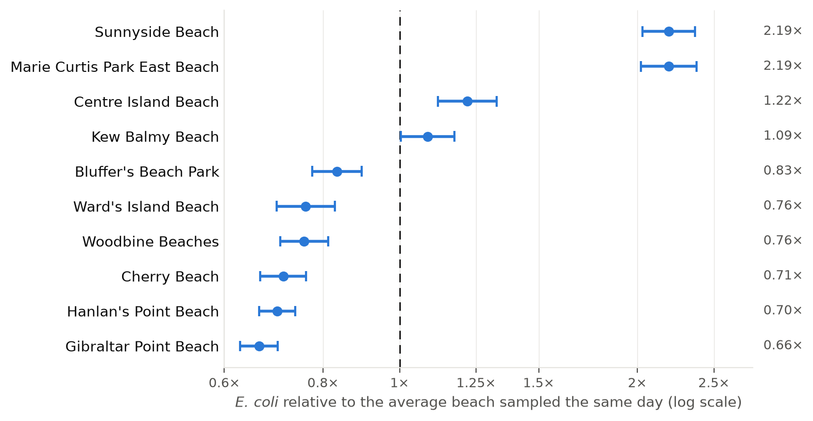

<!-- Draft. Each paragraph starts with a [tag] from other/notes/story_outline.md. Placeholders are in italics. -->

# Introduction {#sec-intro}

[Why E. coli] *E. coli* is a sign of faecal pollution. It lives in the gut of people and other warm-blooded animals, so finding it in lake water means that sewage, storm-water runoff or bird droppings have arrived recently, bringing the viruses and bacteria that make swimmers ill [@sanchez2021]. Swimming in water above Toronto's standard raises the risk of ear, eye, nose, throat and skin infections, and swallowed water can cause stomach illness. Young children, older people and people with weakened immune systems are most at risk [@tphabout].

*[Questions and gap] Placeholder: the two questions (do some beaches go over the limit more often; how well does yesterday's result predict today's) and the gap: no published comparison of the beaches over 20 years, and no check of the one-day delay.*

*[Findings] Placeholder: 34% and 32% of days at Marie Curtis Park East and Sunnyside against 4% at Gibraltar Point; a warning based on yesterday catches 37% of the days over the limit.*

*[Why it matters] Placeholder: which beach matters more than which day, and the posting is a weak guide.*

*[Roadmap] Placeholder: @sec-data describes the data, how a sample becomes a number, and the methods; @sec-results gives the results; @sec-discussion what they mean and their limits. The appendices cover cleaning and the check on simulated data.*

# Data {#sec-data}

## Source and context {#sec-data-source}

[Data source] To reduce water-borne illness among swimmers, Toronto Public Health, Toronto Water, the police Marine Unit and the City's parks division jointly sample the water at the city's ten supervised beaches every day from Victoria Day to Labour Day [@tphdata]. Samples are taken at four to six fixed sites along each beach (@fig-sites-map), and when the laboratory count of *E. coli* at a beach is too high, Toronto Public Health posts signs warning against swimming [@tphbeachwq]. The results are published on the City's open data portal [@tphdata; @opendatatoronto] and form the data for this paper.

{#fig-sites-map}

[Swimming limit] Toronto's standard of 100 *E. coli* per 100 mL is half that of Ontario and Health Canada: Health Canada raised its guideline from 100 to 200 in 2012, and Ontario follows it, whereas Toronto retained the earlier, stricter value [@tphabout; @sanchez2021]. Because 100 is the level at which Toronto posts warnings, it is the limit used throughout this paper.

[Ethics and alternatives] Because the data describe water quality rather than people, they raise no privacy concerns; the ethical stakes lie instead in the advice built on them, since a needless warning costs swimmers a beach day and a missed one exposes them to illness [@saleem2023]. The City also offers each beach's daily swimming condition for download [@tphbeachwq], but the open data were used here because they give every individual result, allowing each day's status to be calculated the same way for all twenty years.

[Software] The analysis uses Python [@python] with Polars [@polars], NumPy [@numpy], statsmodels [@statsmodels], pointblank [@pointblank], matplotlib [@matplotlib] and contextily [@contextily], and the paper is written in Quarto [@quarto].

## Measurement {#sec-data-measurement}

[Columns] Each row of the dataset records one site on one day: the beach, a site code and its location (@fig-sites-map), the date of collection and the *E. coli* result. To obtain each result, staff collect 200 mL of water about 30 cm below the surface at each of the beach's sites (five at most beaches, six at Kew Balmy and four at Sunnyside), and a Public Health Ontario laboratory counts the *E. coli* by membrane filtration, in which bacteria trapped on a filter grow overnight into visible colonies that are counted and scaled to a volume of 100 mL [@phobeach]. Because the process takes about a day, a posted result describes the previous day's water quality [@tphabout; @tphbeachwq]. When no sample could be taken, usually because of bad weather, the result was left blank [@tphabout]; 3.5% of rows are blank.

[Floor and ceiling] The laboratory's reporting limits compress the data at both ends (@fig-raw-results). Results below 10 are rarely reported, so the 49% of results at exactly 10 are best read as "10 or fewer". From 2018, high results were increasingly reported as exactly 1,000; earlier results reached 15,820, whereas none exceeded 1,000 in 2026, which suggests that a reporting ceiling was introduced. Because both limits narrow the range, differences among the cleanest beaches and the severity of the worst days are likely understated. The ceiling can also hide a day over the limit: since 2018, 34 days at a beach included a result of 1,000 yet had a daily geometric mean (@sec-data-methods) below 100, and on about 8 of them a true result of 2,000 or less would have put the day over. The true number of days over the limit since 2018 may therefore be slightly higher than the number calculated from these data.

![Every result the City has published, 2007 to 2026. One point is one water sample (98,991 in total), before any cleaning. The vertical axis is logarithmic, so each gridline is 100 times the one below. Points are spread sideways within each year so that they can be seen; the *E. coli* count itself is never moved. Most results are reported in multiples of 10, which is why the low readings fall into separate rows. The laboratory reports no results as zero, and "no colonies detected" is assumed to be reported as 10. From 2018 on, many results are reported as exactly 1,000, and these are assumed to be readings of 1,000 or more. The dashed line marks 100 *E. coli* per 100 mL, the level at which the City posts a swimming warning. The ringed point is the only reading the analysis removes.](figures/all-raw-results.png){#fig-raw-results}

[Cleaning] Before analysis, three groups of results were removed: one implausible reading (ringed in @fig-raw-results), the results from two sites that lie far from the beaches they are listed under (@fig-sites-map), and results from dates outside the swimming season. The remaining 98,370 results come from 50 sites on 2,019 days across 20 years; Appendix [-@sec-appendix-cleaning] gives the details.

[Summary statistics] Most results are low, but two beaches stand apart (@tbl-beach-summary). At eight of the ten beaches the median result (the middle value when all results are ranked) is 10 or 20, and at Gibraltar Point, the cleanest, 61% of results are at the floor of 10 and only 6% exceed 100. At Marie Curtis Park East and Sunnyside, by contrast, the medians are 50 and 60, only 27% and 20% of results are at the floor, and 35% and 34% exceed 100, about six times the share at Gibraltar Point.

```{python}
#| label: tbl-beach-summary
#| tbl-cap: "Results at each beach, 2007 to 2026. A result is the number of *E. coli* per 100 mL in one water sample. Ten is usually the lowest value the laboratory reports, and 100 is Toronto's limit for swimming. The 90th percentile is the level that one result in ten exceeds. Beach-days are days with at least four results. Beaches run from the largest share of results above 100 to the smallest."
#| tbl-colwidths: [31, 6, 10, 10, 14, 7, 11, 11]
#| output: asis

import polars as pl

from toronto_beaches_ecoli.analysis import daily_geometric_means

results = pl.read_csv(
    "../data/02-analysis_data/analysis_data.csv", try_parse_dates=True
)
beach_days = daily_geometric_means(results).group_by("beachName").len("beachDays")
summary = (
    results.group_by("beachName")
    .agg(
        pl.col("siteName").n_unique().alias("sites"),
        pl.len().alias("results"),
        pl.col("eColi").median().alias("median"),
        pl.col("eColi").quantile(0.9, "nearest").alias("p90"),
        (pl.col("eColi") <= 10).mean().alias("atFloor"),
        (pl.col("eColi") > 100).mean().alias("over100"),
    )
    .join(beach_days, on="beachName")
    .sort("over100", descending=True)
)

def short_name(beach: str) -> str:
    """The beach name without "Beach", which the column heading already says."""
    return beach.replace(" Beach Park", " Park").removesuffix(" Beaches").removesuffix(" Beach")


print(
    "| Beach | Sites | Results | Median | 90th percentile "
    "| At 10 | Above 100 | Beach-days |"
)
print("|:--|--:|--:|--:|--:|--:|--:|--:|")
for row in summary.iter_rows(named=True):
    print(
        f"| {short_name(row['beachName'])} | {row['sites']} | {row['results']:,} "
        f"| {row['median']:,.0f} | {row['p90']:,.0f} "
        f"| {row['atFloor']:.0%} | {row['over100']:.0%} | {row['beachDays']:,} |"
    )
```

## Methods {#sec-data-methods}

[Beach-days] Because Toronto's limit applies to the geometric mean of a beach's results on a day rather than to any single result [@young2023], the analysis works with beach-days. The geometric mean of $n$ results is the $n$th root of their product, or equivalently the average of their logarithms converted back. It suits counts that span orders of magnitude, because a single extreme result does not dominate it: results of 10, 10, 10, 10 and 1,000 give a geometric mean of 25, against an ordinary average of 208. A beach-day was counted only when it had at least four results, rather than five, so that Sunnyside (four sites) is included. This gives 19,662 beach-days, of which 2,816 (14%) were over the limit. A day over the limit is not necessarily a day on which a warning was posted---the data do not record postings. Saleem et al. describe posting decisions based on a geometric mean over two days [@saleem2023]. In addition, a posted warning reflects the previous day's water quality, because testing takes about 24 hours (@sec-data-measurement).

[Model] To test whether the differences reflect the beaches rather than the weather on the days each was sampled, each beach was compared only with the other beaches sampled on the same day. For beach $b$ on day $d$, the model is

$$\log_{10} G_{bd} - \bar{L}_d = \beta_b + \varepsilon_{bd},$$ {#eq-model}

where, in @eq-model, $G_{bd}$ is the beach's geometric mean that day, $\bar{L}_d$ is the average of $\log_{10} G$ over all beaches sampled that day, $\beta_b$ is the beach's average gap from the others, and $\varepsilon_{bd}$ is the day-to-day variation the model does not explain. Subtracting each day's average removes anything that affects all beaches at once, such as a city-wide storm. Because the model works on a log scale, a gap of $\beta_b = 0.3$ means about twice the *E. coli* of the average beach on the same day ($10^{0.3} \approx 2$).

[Model] The standard error of each $\beta_b$ was calculated from the variation between months rather than between days, because a wet week raises a beach's levels for several days running. The few sampling days in late May and early September were counted with June and August. Grouping days this way roughly doubles the width of the intervals compared with treating every day as independent. Each estimate is reported with a 95% interval: if the analysis were repeated over many different runs of summers, about 95% of such intervals would contain the true gap. Two beaches were said to differ significantly when a gap as large as the one observed would arise less than 5% of the time if they were in fact alike. Testing all 45 pairs this way would produce about two false differences by chance, so the comparisons were corrected by Holm's method, which raises the bar each comparison must clear so that the chance of any false difference stays near 5%.

[Consecutive days] Because results take about a day, the sign on display at a beach on any day, called here the posting day, is based on the samples taken the day before. The City posts a "Warning" sign when *E. coli* is over its limit and a "Safe" sign otherwise [@tphabout]. To measure how often the sign was right, each posting day was paired with the previous day at the same beach, using only days that were consecutive (18,998 pairs). The sign on the posting day was taken to be "Warning" if the previous day's geometric mean was over the limit, and "Safe" if it was not. That sign was then compared with the water quality measured on the posting day itself.

# Results {#sec-results}

[Beach comparison] Two beaches were over the limit far more often than the other eight (@fig-beach-days). Marie Curtis Park East was over the limit on 34% of its sampled days and Sunnyside on 32%, more than seven times the 4% at Gibraltar Point, the cleanest beach. The other seven beaches ranged from 16% at Kew Balmy to 7% at Cherry and Hanlan's Point. Sunnyside also stands out in the shape of its distribution: it is the only beach with more days between 30 and 100 than below 30, so its typical day is higher, not only its worst. The ranking is not the result of a few bad years. In 19 of the 20 years, both Marie Curtis and Sunnyside were over the limit more often than every other beach; the exception was 2021, when Kew Balmy (27%) passed Sunnyside (25%). Nor is it an effect of the reporting ceiling introduced in 2018: Marie Curtis was over the limit on 37% of days before 2018 and 31% from 2018, Sunnyside on 32% in both periods, and Gibraltar Point on 5% and 4%.

{#fig-beach-days}

[Model estimates] The same-day comparison gives the same ranking (@fig-beach-estimates). On a typical day, Marie Curtis Park East and Sunnyside each had about 2.2 times the *E. coli* of the average beach sampled that day (95% intervals 2.0 to 2.4 times), whereas Gibraltar Point had about a third less (0.66 times). The two worst beaches did not differ from each other (both 2.19 times), but each differed significantly from every other beach. Of the 45 pairs of beaches, 31 differed after Holm's correction (Appendix [-@sec-appendix-pairs]); the 14 that did not were Marie Curtis and Sunnyside, Centre Island and Kew Balmy, and 12 pairs among the six cleanest beaches. Centre Island ranks above Kew Balmy in the model (1.22 against 1.09 times) but below it in the share of days over the limit (14% against 16%), because the model compares typical levels on the same day, whereas the share counts only how often 100 is crossed. The gaps shown are smaller than the true gaps: in simulated data with known differences, the reporting floor and ceiling reduced the estimated gaps to about 65% of their true size, without reversing any of them (Appendix [-@sec-appendix-validation]).

{#fig-beach-estimates}

[Yesterday vs today] @tbl-warning compares the sign posted at each beach with the water quality measured on the posting day, for 18,998 pairs of consecutive days. The rows give the sign, "Warning" or "Safe", which is based on the previous day's samples; the columns give whether the posting day's water was over or under Toronto's limit. The sign was right on 1,002 days with a "Warning" sign and water over the limit, and on 14,584 days with a "Safe" sign and water under it. It was wrong on 1,712 days with a "Warning" sign and water under the limit, and on 1,700 days with a "Safe" sign and water over it. @tbl-sign-questions gives percentages derived from these counts, as answers to questions relevant to a Toronto beach swimmer.

```{python}
#| label: tbl-warning
#| tbl-cap: "Sign posted at each beach, based on the previous day's samples, against the water quality on the posting day, for pairs of consecutive days, 2007 to 2026. Each cell gives the number of pairs and its share of all pairs."
#| tbl-colwidths: [34, 33, 33]
#| output: asis

confusion = pl.read_csv("../other/results/warning-confusion-matrix.csv")
SIGN_LABELS = {"Warning": "\"Warning\" sign", "All-clear": "\"Safe\" sign"}

print("| Sign posted | Water over the limit on the posting day | Water under the limit |")
print("|:--|--:|--:|")
for row in confusion.iter_rows(named=True):
    print(
        f"| {SIGN_LABELS[row['advice']]} "
        f"| {row['overTodayDays']:,} ({row['overTodayShare']:.1%}) "
        f"| {row['underTodayDays']:,} ({row['underTodayShare']:.1%}) |"
    )
```

```{python}
#| label: tbl-sign-questions
#| tbl-cap: "What the sign says about the water quality on the posting day, 2007 to 2026, derived from the counts in @tbl-warning. The sign is based on the previous day's samples."
#| tbl-colwidths: [85, 15]
#| output: asis

counts = {row["advice"]: row for row in confusion.iter_rows(named=True)}
warning, safe = counts["Warning"], counts["All-clear"]
warning_days = warning["overTodayDays"] + warning["underTodayDays"]
safe_days = safe["overTodayDays"] + safe["underTodayDays"]
over_days = warning["overTodayDays"] + safe["overTodayDays"]
questions = [
    ("On any posting day, how often was the water over the limit?", over_days / (warning_days + safe_days)),
    ('When the "Warning" sign was up, how often was the water over the limit?', warning["overTodayDays"] / warning_days),
    ('When the "Warning" sign was up, how often was the water under the limit?', warning["underTodayDays"] / warning_days),
    ('When the "Safe" sign was up, how often was the water over the limit?', safe["overTodayDays"] / safe_days),
    ('When the water was over the limit, how often was the "Warning" sign up?', warning["overTodayDays"] / over_days),
]
print("| Question | Answer |")
print("|:--|--:|")
for question, share in questions:
    print(f"| {question} | {share:.0%} |")
```

# Discussion {#sec-discussion}

[Summary] Twenty years of Toronto's beach monitoring give a consistent picture. Marie Curtis Park East and Sunnyside were over the limit on about a third of sampled days, more than seven times as often as Gibraltar Point, and this ranking held from year to year and on both sides of the 2018 change in reporting. Compared on the same days, both carried about twice the *E. coli* of the average beach, and because the reporting limits compress the data, the true gaps are likely larger. The sign posted each day, by contrast, was a weak guide to that day's water quality: it missed nearly two thirds of the days over the limit, and nearly two thirds of the "Warning" signs went up on days when the water was under the limit. For a swimmer, the choice of beach therefore says more about the water quality than the sign posted on the day.

[Why beaches differ] The two worst beaches share a location at the mouth of a river. Marie Curtis Park East lies at the mouth of Etobicoke Creek, and Sunnyside lies beside the mouth of the Humber River, where a breakwall shelters the beach from the waves of the open lake [@saleem2023]. Both rivers drain urban land, and higher stream flow has been associated with higher *E. coli* at Toronto beaches [@sanchez2021]; at Sunnyside, the breakwall may also hold river water near the shore rather than letting it disperse. By contrast, three of the four island beaches, which face the open lake away from any river mouth, were among the cleanest; Centre Island was the exception. These explanations remain hypotheses that the present analysis does not test. Two analyses of these data could test them: comparing the sites within each beach, since sites nearer a river mouth should have higher results if the river is the source, and linking daily results to river flow and rainfall, to see whether the gap between beaches widens after heavy rain.

[Improving warnings] The weakness of the daily sign follows from the one-day delay: water quality changes faster than the testing can follow, so a sign based on the previous day's samples misses most days over the limit and puts up most of its warnings on days under the limit. The City acknowledges this, advising swimmers to stay out of the water for 24 to 48 hours after heavy rain and when the water is cloudy [@tphbeachwq]. Two approaches could narrow the gap. The first is a predictive model that estimates the day's water quality from conditions such as rainfall, wind direction and turbidity; Toronto Public Health piloted one with Environment Canada at Marie Curtis Park East and Sunnyside in 2022, but had suspended it by 2025 [@tphabout]. The second is same-day testing. At the same two beaches, a qPCR method, which measures the DNA of *Enterococcus*, another faecal bacterium, within a few hours, indicated that 5% of the City's posting decisions had missed a health risk and 23% had closed the beach unnecessarily [@saleem2023]. Because these are the beaches with the most days over the limit, they are also where a faster or predictive warning would help swimmers most.

[Weaknesses] Four limitations qualify these results. First, the signs in this paper were reconstructed from the sample results rather than taken from the City's records of what was posted. Because the City may base its decisions on a geometric mean over two days [@saleem2023], the signs actually posted may have been right more or less often than the reconstructed ones. Second, the reporting floor at 10 and ceiling at 1,000 compress the data, so the gaps between beaches are understated; in simulated data, only about 65% of a true gap survived. Third, the analysis uses no weather data, so it cannot say how much of the day-to-day variation, or of the difference between beaches, follows from rainfall and wind. Fourth, Sunnyside has four sites where most beaches have five, which makes its daily geometric mean noisier and slightly more likely to cross the limit; in simulated data this added well under one percentage point to its share of days over the limit, far too little to explain its 32%.

[Next steps] The most direct next step is to replace the reconstructed signs with the ones actually posted. The City's beach water quality page offers each beach's daily swimming conditions for download [@tphbeachwq], which may record the posted sign; comparing those with the water quality measured on each posting day would show how well the real signs performed, and whether a rule based on two days does better than one based on a single day. As suggested above, comparing sites within each beach and linking daily results to river flow and rainfall would then show why the two west-end beaches are worse and whether a weather-based prediction could warn swimmers on the day itself.

\newpage

\appendix

# Appendix {-}

# Data cleaning {#sec-appendix-cleaning}

[Cleaning details] The data were downloaded from Open Data Toronto on 22 September 2026 [@tphdata] and contain 102,534 rows, one for each site on each sampling day from 3 June 2007 to 16 September 2026. Of these, 3,543 (3.5%) have no result, usually because no sample could be taken, which leaves 98,991 results. Three groups of results were then removed. The first is a single reading of 6,191,768 *E. coli* per 100 mL at Marie Curtis Park East on 15 June 2009, about 390 times the next highest result in the record (15,820), which was treated as an error. The second is the 220 results from sites 60W and GP6, both added on 19 May 2026: they are listed under Sunnyside and Gibraltar Point but lie 14 to 16 km away, between Kew Balmy and Bluffer's Park, whereas every other site lies within 0.4 km of the rest of its beach.^[On 25 September 2026, Toronto Public Health staff said that the listing of these two sites had been referred for correction (personal communication). This paper uses the data as downloaded on 22 September 2026, so a later correction does not change its results, but a new download may list these sites differently.] The third is 400 results from dates outside the sampling season, taken here as Victoria Day to Labour Day; the City describes the season as June to Labour Day [@tphabout], but in most years since 2012 sampling has begun just after Victoria Day. The remaining 98,370 results come from 50 sites on 2,019 days.

[Cleaning details] No other values were changed. Results at the reporting floor of 10 and at the ceiling of 1,000 were kept as reported, as were the 63 results below 10. For the analysis by day, the 50 beach-days with fewer than four results were left out, leaving 19,662 beach-days. The cleaned data were checked with automated tests written with pointblank [@pointblank], covering the columns and their types, the ranges of dates and values, one result per site per day, and the number of sites at each beach.

# Checking the method on simulated data {#sec-appendix-validation}

*[Simulation check] Placeholder: simulated data with known beach differences, the floor and ceiling; the analysis recovers the ordering; censoring leaves about 65% of a true gap; the site-count effect.*

# Pairwise comparisons {#sec-appendix-pairs}

*[Pairwise table] Placeholder: the 45 pairs with Holm-corrected p-values, from `other/results/beach-pairwise-differences.csv`.*

\newpage

# References {-}
